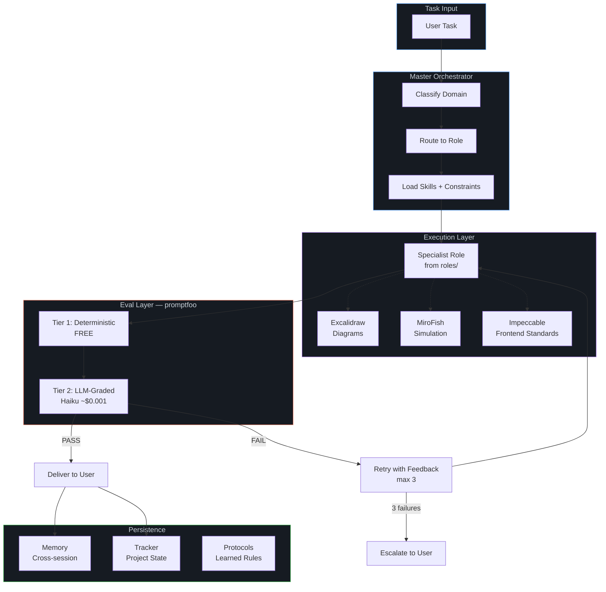
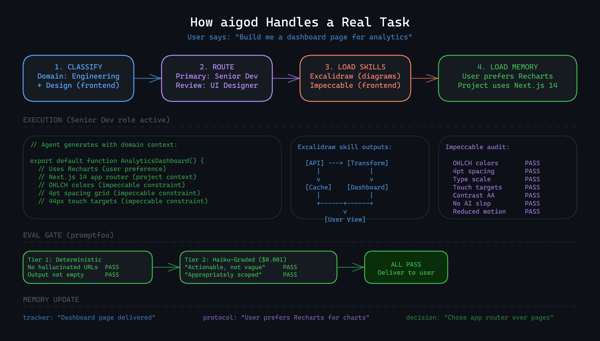

<p align="center">
  
</p>

<p align="center">
  <a href="#-quick-start"></a>
  <a href="LICENSE"></a>
  <a href="#-architecture"></a>
  <a href="CONTRIBUTING.md"></a>
</p>

<p align="center">
  <strong>A cloneable prompt engineering framework for Claude Code.</strong><br>
  <sub>Role templates. Eval gating via promptfoo. Structured context management. Persistent file-based memory.</sub>
</p>

---

## The Problem

You're using Claude Code. It's great. But every session starts from scratch. It doesn't remember your conventions, doesn't know your team structure, doesn't enforce your quality bar, and definitely doesn't know that "Karen from legal flagged the auth tokens again."

You've been copy-pasting system prompts. Writing the same instructions. Getting inconsistent output. Watching it suggest `Inter` font for the hundredth time.

**aigod fixes this.**

## The Solution

aigod is a **structured prompt engineering framework** for Claude Code. It lives in your git repo as a set of markdown files, JSON configs, and eval templates that give Claude Code consistent behavior, domain awareness, and quality standards.

- **Routes tasks** to specialist role definitions via keyword matching in `context/index.json`
- **Evaluates outputs** through promptfoo (deterministic checks + Haiku-graded rubrics)
- **Remembers context** across sessions via file-based memory with structured frontmatter
- **Enforces standards** through constraint skill files (e.g., 21 frontend design rules)
- **Learns from corrections** by saving feedback as protocol files that persist across sessions

```
Your Domain Specs + aigod Framework Files = Consistent, Context-Aware Claude Code Sessions
```

> **Important: What this IS and ISN'T.** aigod is not a software platform or an orchestration engine with code. It's a set of structured prompt files, role templates, and eval configs that leverage Claude Code's native capabilities (CLAUDE.md, skills, file reading). Claude Code is the engine — aigod is the playbook. Think Terraform for AI behavior: declarative config files, not application code.

---

## Who Is This For?

**aigod is ideal when you:**

- Want a **well-thought-out structure** for Claude Code projects instead of ad-hoc prompting
- Value **prompt engineering best practices** and want a framework that codifies them
- Are willing to **build roles and skills yourself** (or import from [agency-agents](https://github.com/msitarzewski/agency-agents)) — this is a scaffold, not a finished product
- Need a **starting point for context management** in long Claude sessions that burn through credits
- Use Claude Code **daily for real work** and are tired of re-explaining your codebase every session
- Want **eval gating** on AI output via promptfoo before it ships
- Appreciate **honest, non-hype documentation** — we tell you exactly what this does and doesn't do

**You probably don't need aigod if:**

- You're exploring Claude for the first time — start with vanilla Claude Code
- Your projects are small one-off scripts — the overhead isn't worth it
- You want a turnkey solution with everything pre-built — this is a framework, not an app
- You don't care about output consistency across sessions
- One generic assistant prompt is fine for everything you do

---

## With aigod vs. Without

| Capability | Claude Code (vanilla) | Claude Code + aigod |
|------------|----------------------|---------------------|
| Context management | No structure — loads what you tell it | JSON index with tiered loading instructions (L0→L1→L2) |
| Task routing | Generic assistant for everything | Role definitions selected by keyword matching |
| Quality control | No eval pipeline | promptfoo integration — deterministic checks + Haiku-graded rubrics |
| Session memory | Starts fresh (unless you use CLAUDE.md) | Structured file-based memory with types, tags, and frontmatter |
| Domain knowledge | You re-explain each session | Loaded from `docs/domain/` specs via CLAUDE.md instructions |
| Frontend standards | No enforcement | 21 design rules in constraint skill file (agent follows, not auto-enforced) |
| Learning | Manual | Corrections saved as protocol files, loaded in future sessions |
| Cost awareness | Full-price model for everything | Haiku as eval grader (~$0.001/check), context loading guidelines |

---

## Architecture



---

## See It In Action

Here's what happens when you say **"Build me a dashboard page for analytics"**:

<p align="center">
  
</p>

**What just happened:**

1. **Classify** — Orchestrator detects engineering + design (frontend) task
2. **Route** — Loads Senior Dev as primary role, UI Designer for review
3. **Load Skills** — Excalidraw for architecture diagram, Impeccable as mandatory frontend constraint
4. **Load Memory** — Recalls you prefer Recharts and the project uses Next.js 14 app router
5. **Execute** — Agent generates code using YOUR stack, YOUR preferences, YOUR conventions
6. **Eval Gate** — Deterministic checks (free) + Haiku-graded quality rubrics ($0.001) — all pass
7. **Deliver** — Output lands in your hands, already validated
8. **Remember** — Tracker updated, decisions logged, preferences reinforced for next session

> Without aigod: "Here's a generic React dashboard with Chart.js and Inter font."
> With aigod: "Here's a Next.js 14 app router page using Recharts, OKLCH colors, 4pt grid, and your existing layout components."

---

## What's Under the Hood

aigod is built on the best open-source tools available — not reinventing wheels, but orchestrating them.

| Component | Powered By | Why This |
|-----------|-----------|----------|
| **Context Management** | [OpenViking](https://github.com/volcengine/OpenViking) | File-system paradigm for context. Three-tier loading (L0 index → L1 summary → L2 full) means you only pay for context you actually need. Sessions stay lean, credits stay low. |
| **Eval Layer** | [promptfoo](https://github.com/promptfoo/promptfoo) | Industry-standard prompt evaluation. Two-tier gating: deterministic checks (free) + LLM-graded rubrics via Haiku ($0.001/eval). Every output quality-checked before delivery. |
| **Simulation Skill** | [MiroFish](https://github.com/666ghj/MiroFish) | Multi-agent prediction framework for strategic foresight. When you need "what if" analysis, scenario modeling, or data-driven forecasting — not guessing. |
| **Frontend Standards** | [Impeccable](https://github.com/pbakaus/impeccable) | 21 enforceable frontend design skills. OKLCH color, 4pt spacing, modular type scales, WCAG AA, and an "AI Slop Test" that auto-fails generic-looking output. |
| **Role Catalog** | [agency-agents](https://github.com/msitarzewski/agency-agents) | Reference library of 120+ role definitions across 12 divisions. aigod ships with 1 example + template — clone the full catalog from agency-agents or write your own. |
| **Orchestration** | [Claude Code](https://claude.ai/code) | Native integration. CLAUDE.md as orchestrator definition, skills system, persistent memory, session protocols. |

---

## Core Layers

<details>
<summary><strong>Layer 0: Context Management</strong> — The foundation that keeps everything efficient (OpenViking)</summary>

<br>

Based on [OpenViking](https://github.com/volcengine/OpenViking) — a context database designed specifically for AI agents. Instead of dumping everything into context and hoping for the best, aigod uses a **JSON-indexed, three-tier loading strategy** that treats context like a file system — not a vector database.

**The Problem It Solves:**
- Sessions bloat with irrelevant context → slower responses, higher costs
- Memory scattered across files with no retrieval strategy → agent loads everything or nothing
- Traditional RAG uses vector embeddings that require external services and lack transparency
- Long conversations lose early context → quality degrades over time
- No visibility into what context informed a decision → debugging is guesswork

**The Core: `context/index.json`**

A single structured JSON file that replaces markdown indexes, YAML configs, and vector databases. It contains:

```json
{
  "memory": {
    "entries": [
      {
        "file": "protocols.md",
        "type": "project",
        "description": "Operational rules and lessons learned",
        "tags": ["rules", "lessons", "behavior"],
        "tokenEstimate": 400,
        "priority": "high"
      }
    ]
  },
  "roles": {
    "routing": {
      "engineering": {
        "enabled": true,
        "keywords": ["code", "build", "deploy", "debug"],
        "roles": [{ "file": "engineering/software-architect.md", "triggers": ["architecture", "system design"] }]
      }
    }
  },
  "skills": {
    "entries": [
      { "name": "excalidraw", "triggers": ["visualize", "diagram"], "constraint": false },
      { "name": "impeccable", "triggers": ["auto:frontend"], "constraint": true }
    ]
  }
}
```

**Why JSON instead of vector DB?**

| | Vector DB (Pinecone, Chroma) | JSON Index (aigod) |
|---|---|---|
| Dependencies | External service required | Zero — just a file |
| Transparency | Black-box retrieval | Human-readable, git-diffable |
| Cost | Embedding API calls | Free |
| Portability | Tied to a service | Lives in your repo |
| Versioning | Complex | `git diff context/index.json` |

**Three-Tier Loading (L0/L1/L2):**

| Tier | What Loads | When | Token Cost |
|------|-----------|------|------------|
| **L0 — Index** | `context/index.json` — descriptions, keywords, tags, token estimates | Every session start | ~300 tokens |
| **L1 — Summary** | File frontmatter, section headers, metadata | When domain is classified | ~500-1000 tokens |
| **L2 — Full** | Complete file contents | Only when actively working on that item | Full file size |

**How It Works:**

```
Session start → read context/index.json (~300 tokens)
  → CLAUDE.md instructs Claude to classify task
  → match keywords in index → identify division + role
  → load ONE role .md file + relevant memory files only
  → execute with targeted context, not everything
```

Note: This is instruction-driven — CLAUDE.md tells Claude how to load context. Claude Code follows these instructions but there's no enforcement engine. The structure makes it easy to follow; discipline depends on prompt quality.

**Session Compression:**
CLAUDE.md instructs the agent to compress context as conversations grow:
1. Summarizes completed work (replace verbose tool outputs with structured summaries)
2. Archives resolved decisions (move to tracker log, release from active context)
3. Extracts persistent learnings (save to memory files, update `index.json`, remove from conversation)
4. References instead of repeating (point to files/commits, don't re-quote them)

**Observable Context:**
Every decision cites what context informed it. If a memory or protocol influenced the approach, it's transparent — no black-box retrieval.

</details>

<details>
<summary><strong>Layer 1: Orchestrator</strong> — The brain that routes everything</summary>

<br>

Defined in `CLAUDE.md`, the orchestrator:

- Reads memory and tracker state on every session start
- Classifies incoming tasks by domain using keyword routing
- Selects the optimal specialist role from the catalog
- Loads relevant skills and constraint layers
- Manages retry logic (max 3 attempts) with eval feedback
- Logs every decision with structured entries
- Updates project state after every significant action

**Session start protocol:**
```
1. Read memory/MEMORY.md → load persistent context
2. Read tracker/tracker.md → check project state
3. Surface stuck/blocked items
4. Greet with current status
```

</details>

<details>
<summary><strong>Layer 2: Roles</strong> — Specialist personas across 12 divisions</summary>

<br>

**You don't need pre-built roles for every task.** When the problem statement is clear, CLAUDE.md instructs the agent to assume the necessary specialist behavior dynamically — no role file needed. Role files are for when you want **specific, repeatable, codified behavior** that you've tuned for your domain.

aigod ships with 1 example role (`software-architect.md`) and a `TEMPLATE.md` for creating your own. For a full library of pre-written roles, see [agency-agents](https://github.com/msitarzewski/agency-agents) (120+ across all divisions). Clone what you need into `roles/`, or write your own.

| Division | Slots | Example Roles |
|----------|-------|---------------|
| Engineering | `roles/engineering/` | Software Architect, Senior Dev, AI Engineer, DevOps |
| Design | `roles/design/` | UI Designer, UX Researcher, Brand Guardian |
| Marketing | `roles/marketing/` | Growth Hacker, SEO Strategist, Content Creator |
| Sales | `roles/sales/` | Outbound Strategist, Deal Closer |
| Product | `roles/product/` | Sprint Prioritizer, Product Manager |
| Project Mgmt | `roles/project-management/` | Project Shepherd, Jira Steward |
| Testing | `roles/testing/` | Evidence Collector, API Tester |
| Support | `roles/support/` | Analytics Reporter, Legal Compliance |
| Specialized | `roles/specialized/` | MCP Builder, Workflow Architect |

Each role is a standalone `.md` file following a structured template:

```yaml
---
name: Software Architect
description: Designs system architecture, evaluates trade-offs
division: engineering
vibe: Thinks in systems, decides in trade-offs
---
```

**Sections:** Identity → Core Mission → Critical Rules → Workflow → Decision Logic → Communication Style → Success Metrics

The CLAUDE.md orchestrator instructs Claude to load **only the matched role file** — not all roles at once.

</details>

<details>
<summary><strong>Layer 3: Skills</strong> — Stateless capabilities invoked on demand</summary>

<br>

Roles define *how* the agent behaves. Skills define *what* it can do.

| Skill | Triggers | What It Does |
|-------|----------|-------------|
| **excalidraw** | "visualize", "diagram", "architecture" | Generates Excalidraw JSON diagrams with a render-validate loop |
| **mirofish** | "predict", "simulate", "scenario", "what if" | Multi-agent simulation for strategic foresight and data-driven predictions |
| **impeccable** | Automatic for all frontend output | Constraint layer enforcing 21 frontend design standards (not optional) |

A Software Architect role might invoke the excalidraw skill to diagram its output. A Product Manager might invoke mirofish to simulate market scenarios. CLAUDE.md instructs the agent to load impeccable constraints for any frontend task.

**Adding custom skills:**
```
.claude/skills/your-skill/
├── SKILL.md          ← Frontmatter + methodology
└── references/       ← Supporting assets
```

</details>

<details>
<summary><strong>Layer 4: Eval Gate</strong> — Quality control via promptfoo</summary>

<br>

Powered by [promptfoo](https://github.com/promptfoo/promptfoo). Two tiers:

**Tier 1 — Deterministic (free, always runs):**
```yaml
- type: not-contains        # No hallucinated URLs
  value: "example.com"
- type: javascript           # Output is not empty
  value: "output.length > 0"
- type: not-contains        # No leaked system prompts
  value: "CLAUDE.md"
```

**Tier 2 — LLM-Graded (~$0.001/eval via Haiku):**
```yaml
- type: llm-rubric
  value: "The response provides specific, actionable guidance
          rather than generic or vague advice."
- type: llm-rubric
  value: "The response addresses exactly what was asked —
          no more, no less. No over-engineering."
```

**Composite scoring:**
```
quality * 0.6 + relevance * 0.3 + cost_efficiency * 0.1
```

**Control flow:** PASS → deliver | FAIL → retry with feedback (max 3) → escalate to user

Three assertion sets included: `quality.yaml`, `safety.yaml`, `domain.yaml` (customizable).

</details>

<details>
<summary><strong>Layer 5: Memory</strong> — Persistent knowledge that survives sessions</summary>

<br>

| Type | Purpose | Example |
|------|---------|---------|
| **user** | Who you are, preferences, expertise | "Senior Go engineer, new to React, prefers terse responses" |
| **feedback** | Corrections and confirmed approaches | "Don't mock the database — got burned last quarter" |
| **project** | Ongoing work context and decisions | "Auth rewrite for SOC2 compliance, deadline April 15" |
| **reference** | Pointers to external systems | "Bugs in Linear project PLATFORM, dashboards at grafana.internal" |
| **protocols** | Evolved rules from past interactions | "Always confirm before touching infrastructure" |

Each memory is a `.md` file with structured frontmatter, indexed in `MEMORY.md` (always loaded, < 200 lines). The agent learns from corrections and **never repeats the same mistake twice**.

</details>

<details>
<summary><strong>Layer 6: Frontend Constraints</strong> — The Impeccable standard</summary>

<br>

Based on [Impeccable](https://github.com/pbakaus/impeccable) — 21 enforceable frontend design skills. This is a **mandatory constraint**, not an optional skill. Any agent output touching HTML/CSS/JS passes through:

```
/audit → /normalize → /harden → /polish → /critique
```

**The 7 Standards:**

| Standard | Key Rules |
|----------|-----------|
| Typography | No Inter/Roboto defaults, modular type scale, 16px min body |
| Color | OKLCH color space, tinted neutrals, 60-30-10 ratio |
| Spatial | 4pt base, `gap` over margin, container queries |
| Motion | Meaningful only, `prefers-reduced-motion`, no bounce easing |
| Interaction | 44px touch targets, visible focus indicators |
| Responsive | Mobile-first, fluid `clamp()`, logical CSS properties, i18n budget |
| Accessibility | WCAG AA minimum (4.5:1 body, 3:1 UI), semantic HTML |

**Auto-fail triggers:** Glassmorphism, gradient text, nested cards, pure black on white, z-index > 100, `!important` without justification.

**The AI Slop Test:** "Would someone guess AI generated this?" If yes → fail.

</details>

---

## Quick Start

Pick the setup that fits how you work:

### Prerequisites

- [Claude Code](https://claude.ai/code) (CLI) — for Option A and B
- [Claude Pro/Team](https://claude.ai) — for Option C (Projects)
- Node.js 18+ (for promptfoo evals)
- Git

---

### Option A: Local Repo + Cloud Backup (Recommended)

Your own personal agent repo, backed up to GitHub/GitLab for sync across machines.

```bash
# 1. Clone to your local workspace
git clone https://github.com/dnsatgit/aigod.git my-agent
cd my-agent

# 2. Make it YOUR repo (disconnect from aigod upstream)
rm -rf .git
git init
git add -A
git commit -m "Initialize my agent from aigod framework"

# 3. Push to your own private repo for cloud backup
git remote add origin https://github.com/YOUR_USERNAME/my-agent.git
git push -u origin main

# 4. Install eval dependencies
npm install

# 5. Customize (see table below), then run
claude
```

Your agent now lives in a private repo. Push regularly — your memory, protocols, and tracker are version-controlled. Roll back mistakes. Sync across devices. Your agent's brain is backed up.

---

### Option B: Claude Code Session (Quick & Direct)

Open any existing project folder with Claude Code and point it at aigod.

```bash
# 1. Clone aigod INTO your existing project as a subfolder
cd /path/to/your/project
git clone https://github.com/dnsatgit/aigod.git .aigod

# 2. Copy the orchestrator into your project root
cp .aigod/CLAUDE.md ./CLAUDE.md

# 3. Symlink or copy the framework pieces you need
cp -r .aigod/roles ./roles
cp -r .aigod/evals ./evals
cp -r .aigod/memory ./memory
cp -r .aigod/tracker ./tracker
cp -r .aigod/.claude ./.claude

# 4. Install eval dependencies
npm install --prefix .aigod

# 5. Customize, then open with Claude Code
claude
```

Claude Code reads `CLAUDE.md` from the project root automatically. Your agent lives alongside your code — context about your actual codebase is immediate.

---

### Option C: Claude Projects (Web UI)

Use aigod as the system prompt and knowledge base for a Claude Project on claude.ai.

1. **Create a new Project** at [claude.ai](https://claude.ai)
2. **Set the Project Instructions** — paste the contents of `CLAUDE.md` into the project's custom instructions
3. **Upload knowledge files:**
   - `roles/index.yaml` — so the agent knows what roles are available
   - Any specific role `.md` files you want active
   - `memory/protocols.md` — your established rules
   - `docs/domain/` contents — your domain specs
4. **Seed the conversation** — tell the agent who you are, what you're working on, and your preferences. It will save these as memory for the project.

> **Note:** Claude Projects doesn't have file system access, so evals (promptfoo), skills (excalidraw), and the tracker won't run automatically. You get the orchestrator brain, role routing, and memory — but without the automation layer. For the full experience, use Option A or B.

---

### After Setup: Customize

| Step | What | Where |
|------|------|-------|
| Add your specs | Company docs, conventions, architecture | `docs/domain/` |
| Pick your roles | Enable relevant divisions | `roles/index.yaml` |
| Set your quality bar | Domain-specific eval assertions | `evals/assertions/domain.yaml` |
| Seed memory | Who you are, project context, preferences | `memory/` |
| Add skills | Domain-specific capabilities (optional) | `.claude/skills/` |

See [CUSTOMIZE.md](CUSTOMIZE.md) for the full walkthrough.

### Verify It Works

```bash
# Open with Claude Code
claude

# The agent should:
# 1. Read memory/MEMORY.md (L0 context index)
# 2. Read tracker/tracker.md (project state)
# 3. Greet you with current status
# 4. Ask what you're working on (if first session)
```

```bash
# Run evals manually (Option A/B only)
npm run eval
npm run eval:view
```

---

## Domain Examples

<details>
<summary><strong>Software Engineering Team</strong></summary>

```yaml
# roles/index.yaml
divisions:
  engineering: { enabled: true }
  testing: { enabled: true }
  product: { enabled: true }
  project-management: { enabled: true }
```

```markdown
<!-- memory/user_team.md -->
---
name: user_team
description: Backend-heavy team, Go + PostgreSQL, microservices architecture
type: user
---
Full-stack team of 6. Primary stack: Go, PostgreSQL, gRPC, React.
Monorepo. CI via GitHub Actions. Deploy to AWS ECS.
```

</details>

<details>
<summary><strong>Marketing Agency</strong></summary>

```yaml
# roles/index.yaml
divisions:
  marketing: { enabled: true }
  design: { enabled: true }
  sales: { enabled: true }
  paid-media: { enabled: true }
```

</details>

<details>
<summary><strong>Solo Founder</strong></summary>

```yaml
# roles/index.yaml
divisions:
  engineering: { enabled: true, roles: [software-architect, senior-dev] }
  product: { enabled: true, roles: [sprint-prioritizer] }
  marketing: { enabled: true, roles: [growth-hacker] }
  design: { enabled: true, roles: [ui-designer] }
```

</details>

---

## Directory Structure

```
aigod/
├── CLAUDE.md                      # Master orchestrator brain
├── CUSTOMIZE.md                   # Your setup guide
├── package.json
│
├── context/
│   ├── index.json                 # L0 master index (THE routing brain)
│   ├── schema.json                # JSON schema for index validation
│   └── sessions/                  # Session state snapshots
│
├── .claude/
│   ├── commands/                  # Custom slash commands
│   └── skills/
│       ├── excalidraw/            # Diagramming
│       ├── mirofish/              # Predictive simulation
│       └── impeccable/            # Frontend constraint layer
│
├── roles/
│   ├── index.yaml                 # Human-friendly routing config
│   ├── TEMPLATE.md                # Create your own roles
│   ├── engineering/               # 23 roles
│   ├── design/                    # 8 roles
│   ├── marketing/                 # 28+ roles
│   ├── sales/                     # 8 roles
│   ├── product/                   # 5 roles
│   ├── project-management/        # 6 roles
│   ├── testing/                   # 8 roles
│   ├── support/                   # 6 roles
│   └── specialized/               # 27 roles
│
├── evals/
│   ├── promptfooconfig.yaml       # Global eval config
│   └── assertions/                # quality, safety, domain
│
├── memory/                        # Persistent cross-session knowledge (.md files)
├── tracker/                       # Single source of truth
├── docs/                          # Architecture + your domain specs
└── scripts/                       # Setup automation
```

> **Why `context/index.json` instead of vector DB or markdown index?**
> JSON is structured (no LLM needed to parse), git-trackable (diffable), human-editable, zero dependencies (no Pinecone/Chroma/Weaviate), and naturally hierarchical (maps to L0/L1/L2 tiers). Content stays as markdown for readability. The index is JSON for routing.

---

## How It Learns


**Example:**
1. You say: *"Don't mock the database in these tests — we got burned last quarter"*
2. aigod saves a feedback memory with the rule AND the reason
3. Next session, it loads that memory and applies the rule
4. It never suggests mocking the database again

---

## Cost Efficiency

aigod is designed to minimize credit burn at every layer:

### Context Loading (OpenViking tiered strategy)

The JSON index approach instructs Claude to load context incrementally rather than all at once. Actual savings depend on your repo size and number of memory/role files — more files = more savings from selective loading.

| Strategy | What Happens |
|----------|-------------|
| No structure | Claude reads whatever you point it to, or everything in CLAUDE.md |
| aigod tiered loading | Reads `context/index.json` first (~300 tokens), then loads only matched role + relevant memories |
| Session compression | CLAUDE.md instructs Claude to summarize completed work and release dead context |

### Eval Layer

| What | Model | Cost | When |
|------|-------|------|------|
| Deterministic checks | None (regex, contains) | **$0.00** | Every output |
| LLM-graded rubrics | claude-haiku-4-5 | **~$0.001** | Non-trivial outputs |
| Your main agent | claude-sonnet/opus | Your plan | Task execution |

The grader doesn't need to be smart — it just evaluates against a rubric. Haiku handles this at 1/60th the cost of Opus.

### Note on Cost Claims

These are architectural patterns, not benchmarked guarantees. Actual savings depend on your usage patterns, number of files, and session length. The principle is sound — loading less context = fewer tokens = lower cost — but we haven't published formal benchmarks yet. If you measure your own before/after, we'd love a PR with real numbers.

---

## Contributing

See [CONTRIBUTING.md](CONTRIBUTING.md). We welcome:

- New specialist roles
- Custom skills
- Eval assertion sets
- Domain configuration examples
- Bug fixes and improvements

---

## License

MIT — see [LICENSE](LICENSE).

---

<p align="center">
  <strong>Built for the age of AI agents.</strong><br>
  <sub>Clone it. Feed it your specs. Watch it work.</sub>
</p>
